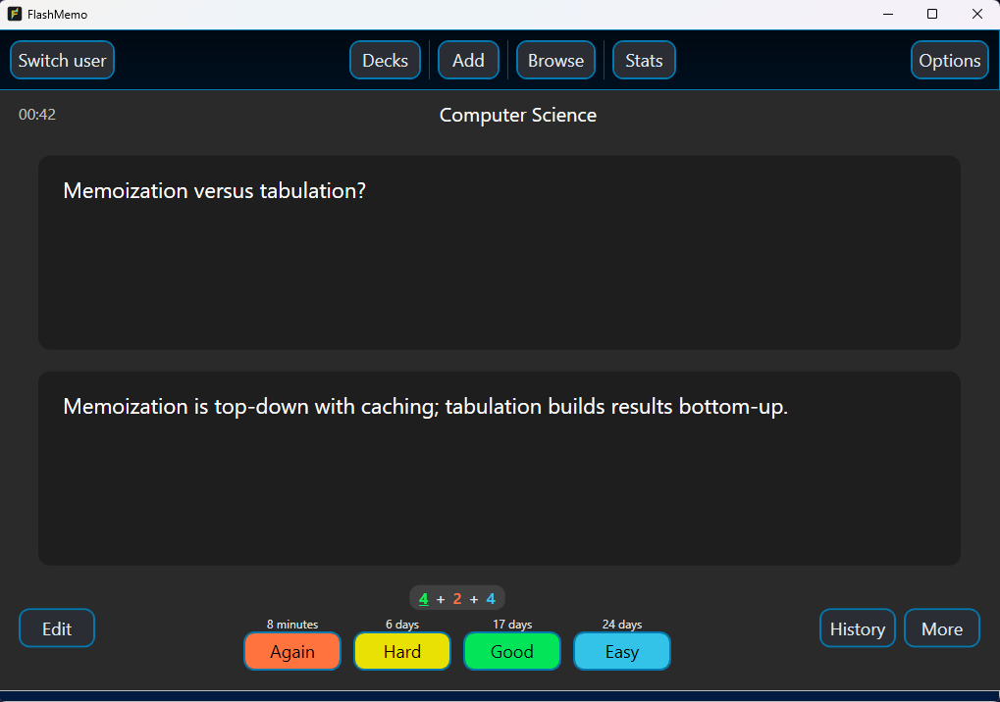
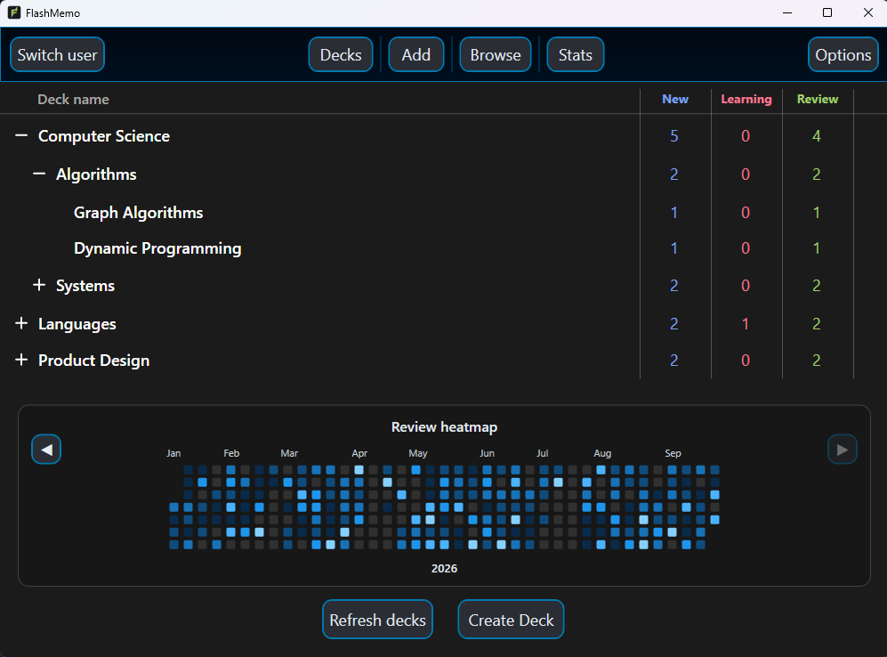
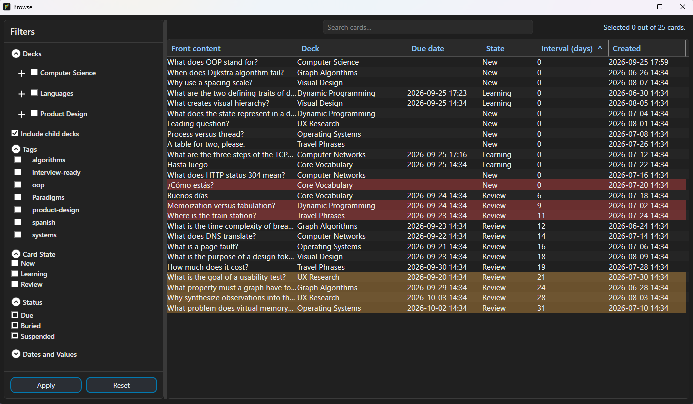
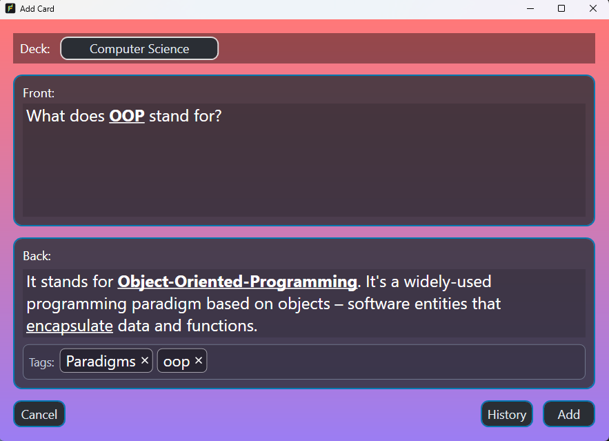
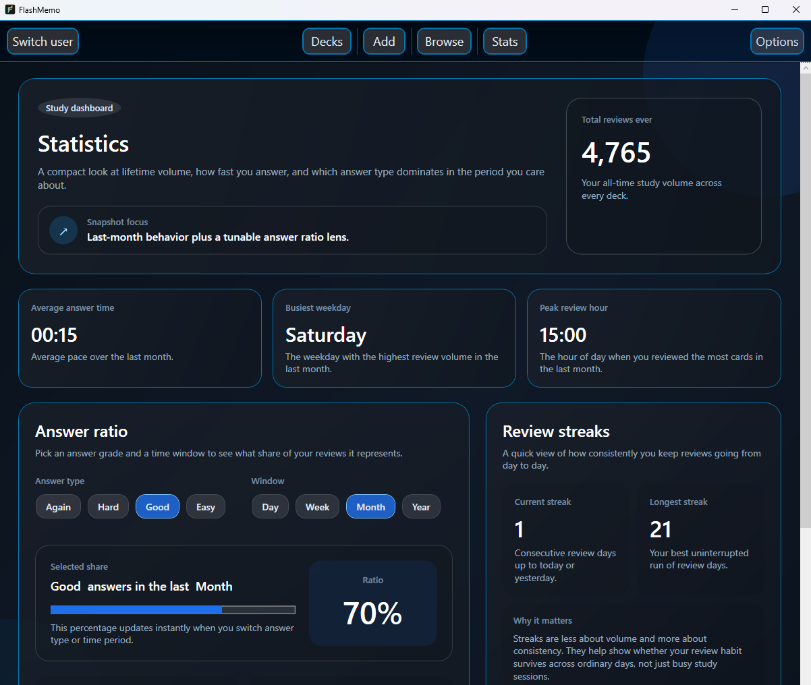
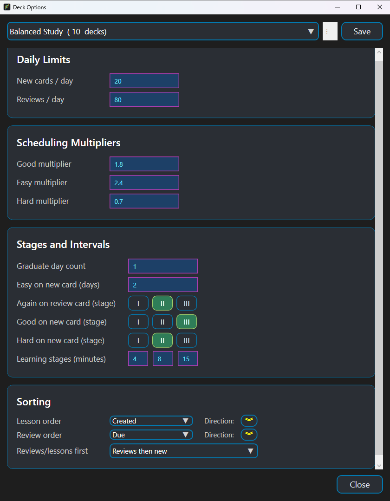

# FlashMemo

FlashMemo is an offline Windows desktop application for creating and reviewing flashcards with a configurable spaced-repetition system.

The project explores the engineering behind a complete desktop product: domain-focused scheduling logic, persistent local data, multi-user state, responsive MVVM navigation, and automated tests around the most important workflows.



*Review cards with clear answer choices and a preview of the resulting interval.*
## Download

[Download the latest FlashMemo release](https://github.com/Nightlite185/FlashMemo/releases/latest)

## Inspiration

FlashMemo is inspired by Anki's approach to spaced repetition. Its scheduling implementation, desktop architecture, interface, and supporting features were developed independently for this project.

## Highlights

- Review cards using **Again**, **Hard**, **Good**, and **Easy**, with a forecast of the resulting interval before committing an answer.
- Organize cards into nested decks and rearrange the hierarchy with drag and drop.
- Configure scheduling per deck through reusable presets:
  - learning-stage durations;
  - interval multipliers;
  - daily lesson and review limits;
  - card ordering and sorting.
- Create and edit formatted front/back notes with reusable tags.
- Browse, search, sort, and filter cards by deck, tag, state, status, dates, and interval.
- Perform bulk card operations including moving, rescheduling, postponing, burying, suspending, forgetting, and deleting.
- Track study activity through a yearly heatmap, review streaks, answer ratios, average answer time, and review-volume statistics.
- Maintain independent local profiles, preferences, and session state for multiple users.
- Store all data locally in SQLite and apply EF Core migrations automatically on startup.

## Interface

### Organize knowledge hierarchically

Group cards into nested decks and use parent decks to study an entire subject at once.



### Find and manage cards

Search, sort, and filter cards by deck, tag, state, status, dates, and interval. Browse also supports bulk operations such as moving, rescheduling, burying, suspending, and deleting cards. Columns can be shown, hidden, resized, reordered, and sorted.



### Create formatted cards

Create rich front-and-back notes, organize them with reusable tags, and choose their destination deck.



### Track study progress

Review lifetime activity, answer behavior, study pace, peak hours, and streaks from the statistics dashboard.



### Configure the scheduler

Each deck can use a reusable preset controlling daily limits, learning stages, interval multipliers, and card ordering.

<details>
<summary>View deck scheduling options</summary>



</details>

## Engineering highlights

- **MVVM architecture** built with CommunityToolkit.Mvvm and view-model factories.
- **Dependency injection** for repositories, services, factories, database contexts, and navigation infrastructure.
- **Separated domain and persistence models**, keeping scheduling behavior independent from EF Core entities.
- **Service and repository layers** for querying, persistence, statistics, deck-tree construction, and session management.
- **Event-driven view-model coordination** so open screens can refresh after domain or settings changes.
- **SQLite integration tests** that exercise real EF Core query translation rather than relying only on mocked repositories.
- **Focused domain tests** covering scheduling transitions, daily limits, statistics, session isolation, persistence, and review workflows.

## Tech stack

| Area | Technology |
| --- | --- |
| Language and runtime | C# / .NET 10 |
| Desktop UI | WPF / XAML |
| Architecture | MVVM, dependency injection, repository and service layers |
| Persistence | Entity Framework Core, SQLite, EF Core migrations |
| MVVM tooling | CommunityToolkit.Mvvm |
| Object mapping | AutoMapper |
| Testing | xUnit, FluentAssertions, Moq.AutoMock, in-memory SQLite |

## Project structure

```text
FlashMemo/
├── Model/
│   ├── Domain/          # Scheduling rules and domain types
│   └── Persistence/     # EF Core entities and DbContext
├── Repositories/        # Data-access abstractions and implementations
├── Services/            # Application logic, queries, navigation, and statistics
├── ViewModel/           # Window, popup, wrapper, and factory view models
├── View/                # WPF windows and user controls
├── Helpers/             # UI behaviors, converters, and shared utilities
├── Migrations/          # EF Core database migrations
└── Tests/               # Unit and SQLite-backed integration tests
```

## Getting started

### Requirements

- Windows 10 or Windows 11
- [.NET 10 SDK](https://dotnet.microsoft.com/download/dotnet/10.0)

### Run locally

```powershell
dotnet restore FlashMemo.sln
dotnet run --project FlashMemo.csproj
```

On first launch, FlashMemo creates its SQLite database and applies the included migrations automatically. Application data is stored under:

```text
%APPDATA%\FlashMemo\Data\flashmemo.db
```

No account, cloud service, or external database is required.

## Running the tests

```powershell
dotnet test FlashMemo.sln --configuration Release
```

The test suite covers scheduling behavior, EF Core query translation, daily review limits, statistics, database initialization, session isolation, and card creation/review workflows, and filtering.

## Current scope

FlashMemo v1.0 supports standard front/back notes and is designed for offline, single-device use.

## What this project demonstrates

FlashMemo was built as a portfolio project to demonstrate more than UI implementation. Its core challenge is coordinating time-dependent scheduling rules, hierarchical data, user-specific configuration, and EF Core persistence without coupling those concerns to the WPF interface.

The result is a testable desktop application with clear architectural boundaries and realistic product concerns such as migrations, destructive-action safeguards, cached session state, validation, and empty-state handling.
